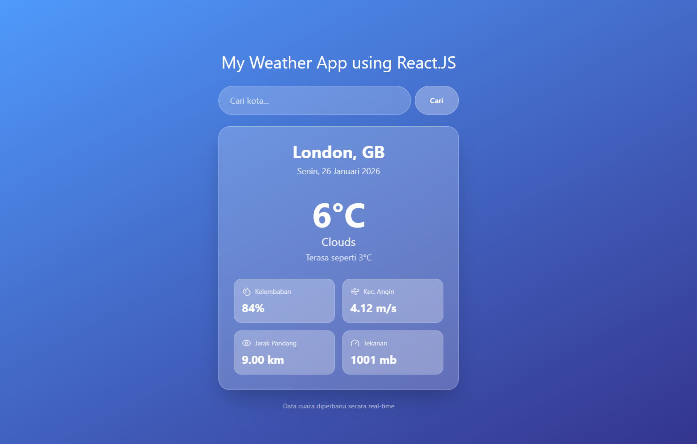

# 🌤️ React Weather App

A modern, responsive weather dashboard featuring a beautiful **Glassmorphism UI**. This app provides real-time weather updates for cities worldwide.

## ⚡ Tech Stack

Built with the latest web technologies for speed and modern styling:

- **React 19** (Core Framework)
- **Vite** (Build Tool)
- **Tailwind CSS 4** (Styling)
- **Lucide React** (Icons)

## ✨ Key Features

Based on **OpenWeatherMap API**, this application allows users to:

- **🔍 Search by City:** Instantly find weather conditions for any location.
- **🌡️ Real-Time Metrics:** Displays temperature, humidity, wind speed, visibility, and air pressure.
- **📅 Dynamic Date:** Auto-updates the current date based on the user's local time.
- **🎨 Glassmorphism Design:** A sleek, semi-transparent interface with a modern gradient background.

---

Built with React
